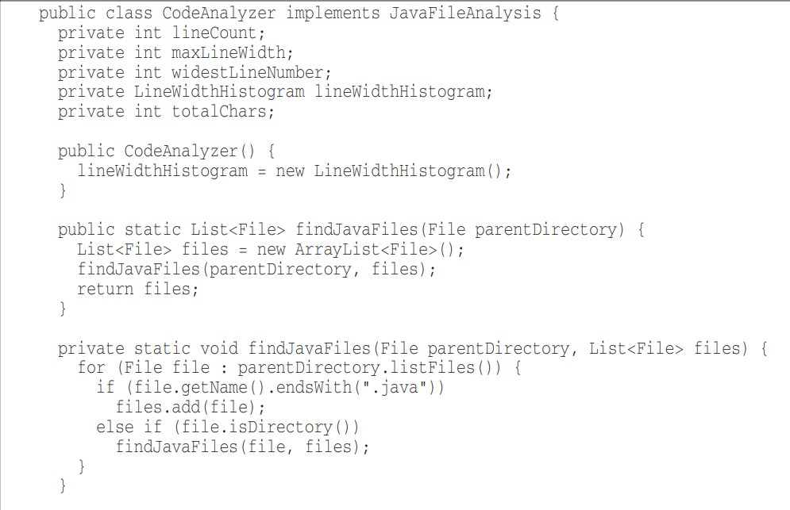

# Chapter 05
```text
all code should be formatted at single format of code
```
## the purpose of formatting
- formatting code is so important for readability and maintainability
- the function you write today may be changed in the next version of the code
- readability of code will have an effect on all changes that will be made in the future

```text
there are two types of formatting that make communication easier:
   1. vertical formatting
   2. horizontal formatting
```
## vertical formatting
### the newspaper metaphor
- how is the newspaper formatted?
  1. start with headline => that allow you to decide whether to read it or ignore
  2. first paragraph => give brief of all story
  3. as you continue down, details increase
- code should be formatted like this
  1. start with good method name, describing what the method does
  2. top most level of code should contain high level concepts and algorithms
  3. details should increase as i go down, until at the end you will find lowest level functions
- newspaper contains different articles of different size, which make it look better, code should be like that too.

### Vertical Openness Between Concepts
- there should be blank line between package declarations, imports and methods
- that blank line make code more readable
```php
package fitnesse.wikitext.widgets;
import java.util.regex.*;

public class BoldWidget extends ParentWidget {
 public static final String REGEXP = "'''.+?'''";
 private static final Pattern pattern = Pattern.compile("'''(.+?)'''",
 Pattern.MULTILINE + Pattern.DOTALL
 );
 
 public BoldWidget(ParentWidget parent, String text) throws Exception {
 super(parent);
 Matcher match = pattern.matcher(text);
 match.find();
 addChildWidgets(match.group(1));
 }
 
 public String render() throws Exception {
 StringBuffer html = new StringBuffer("<b>");
 html.append(childHtml()).append("</b>");
 return html.toString();
 }
}
```
### vertical density
- remove unnecessary comments to make code easier to read 
- notice the difference
```php
public class ReporterConfig {
 /**
 * The class name of the reporter listener
 */
 private String m_className;
 
 /**
 * The properties of the reporter listener
 */
 private List<Property> m_properties = new ArrayList<Property>();
 public void addProperty(Property property) {
 m_properties.add(property);
 }
```
```php
public class ReporterConfig {
 private String m_className;
 
 private List<Property> m_properties = new ArrayList<Property>();
 public void addProperty(Property property) {
 m_properties.add(property);
 }
}
```
### Vertical Distance
- distance between so close method should measure how important each to understand the ability of the other
- concepts that are related should be placed vertically close to each other
- this rule doesn't work for concepts that are seperated in different files
- closely related concepts should not be placed into different files unless you have strong reason to do so

### variable declaration
- variable declaration should be close as possible to their usage
- variables should be defined at the top most of the function
- loop variables should be declared within the loop

### Instance Variables
- instance variables should be defined at the top most of the class, because they will be used in frequently in the class
- where instance variables should be placed?
   - in c++ in the bottom
   - in java in the top

### dependent function
- if one function call the other, their should be vertically closed
- caller should be above the callee as possible
```php
public class WikiPageResponder implements SecureResponder {
 protected WikiPage page;
 protected PageData pageData;
 protected String pageTitle;
 protected Request request;
 protected PageCrawler crawler;
 
 public Response makeResponse(FitNesseContext context, Request request)
 throws Exception {
 String pageName = getPageNameOrDefault(request, "FrontPage");
loadPage(pageName, context);
 if (page == null)
 return notFoundResponse(context, request);
 else
 return makePageResponse(context);
 }
 
 private String getPageNameOrDefault(Request request, String defaultPageName)
 {
 String pageName = request.getResource();
 if (StringUtil.isBlank(pageName))
 pageName = defaultPageName;
 return pageName;
 }
 
 protected void loadPage(String resource, FitNesseContext context)
 throws Exception {
 WikiPagePath path = PathParser.parse(resource);
 crawler = context.root.getPageCrawler();
 crawler.setDeadEndStrategy(new VirtualEnabledPageCrawler());
 page = crawler.getPage(context.root, path);
 if (page != null)
 pageData = page.getData();
 }
 
 private Response notFoundResponse(FitNesseContext context, Request request)
 throws Exception {
 return new NotFoundResponder().makeResponse(context, request);
 }
 
 private SimpleResponse makePageResponse(FitNesseContext context)
 throws Exception {
 pageTitle = PathParser.render(crawler.getFullPath(page));
 String html = makeHtml(context);
 SimpleResponse response = new SimpleResponse();
 response.setMaxAge(0);
 response.setContent(html);
 return response;
 }
...
```
- if there is constant variable like `FrontPage`, it should be passed to function while calling,
passing it while calling make function more clear and easy to understand,
it is a bad thing to encapsulate it inside function,
next time i will use it i have to go to function to remember what wa the value of default 

### Conceptual Affinity.
- if there is a group of functions those do the same task or similar tasks, i must place them close to each other
```php
public class Assert {

static public void assertTrue(String message, boolean condition) {
if (!condition)
fail(message);
}

static public void assertTrue(boolean condition) {
assertTrue(null, condition);
}

static public void assertFalse(String message, boolean condition) {
assertTrue(message, !condition);
}

static public void assertFalse(boolean condition) {
assertFalse(null, condition);
} ...
```
### vertical ordering
- function that is called by another function should be placed below that function
- caller should be above callee
- this create nice flow form high level to low level


## Horizontal Formatting
```text
How wide should line be?
```
- we might follow the rule that say, we mustn't scroll to the right side of the screen
- that rule isn't work nowadays because of wide screens
- so we should set our limit to be `120` characters per line

### Horizontal Openness and Density
- assignment operator (' = ', ' += ') => should be surrounded by spaces
   - assignment has two distinct and major element(left side, right side)
   - space make separation obvious
- function name & opening parenthesis `measureLine(String line)` => don't add space
   - function and its arguments are closely related
   - making separation make them appear disjoint
- function arguments within `(double a, double b, double c)` function call => space after comma
   - to show that those arguments are separate
- math operator `+`, `-`, `*`, `/` => space between them
   - but if they are factor, then no space `b*b - 4*a*c`

### Horizontal Alignment
```php
private   Socket          socket;
private   InputStream     input;
private   OutputStream    output;
private   Request         request;
private   Response        response;
private   FitNesseContext context;
protected long            requestParsingTimeLimit;
```
- that look so bad
- make me read variable name without declaration
- i must write them like that
```php
private Socket socket;
private InputStream input;
private OutputStream output;
private Request request;
private Response response;
private FitNesseContext context;
protected long requestParsingTimeLimit;
```

### Indentation
- leave space before the methods, blocks loops 


### Dummy scopes
```php
while (dis.read(buf, 0, readBufferSize) != -1) 
 ;
```
- if you have to make loop body with no declaration, but `;` in the next line not the same line of the loop

### Team rules
- when you work with team you must use single formatting of code
- you must sit with each other, and put some format rules that all will follow
- like:
   - where we would put our braces
   - what our indent size would be 
   - how we would name classes, functions and variables
   - ....
- then we encode all those rules into the code formatter of IDE

### Uncle Bob’s Formatting Rules
- notice that example as standard code formatter



